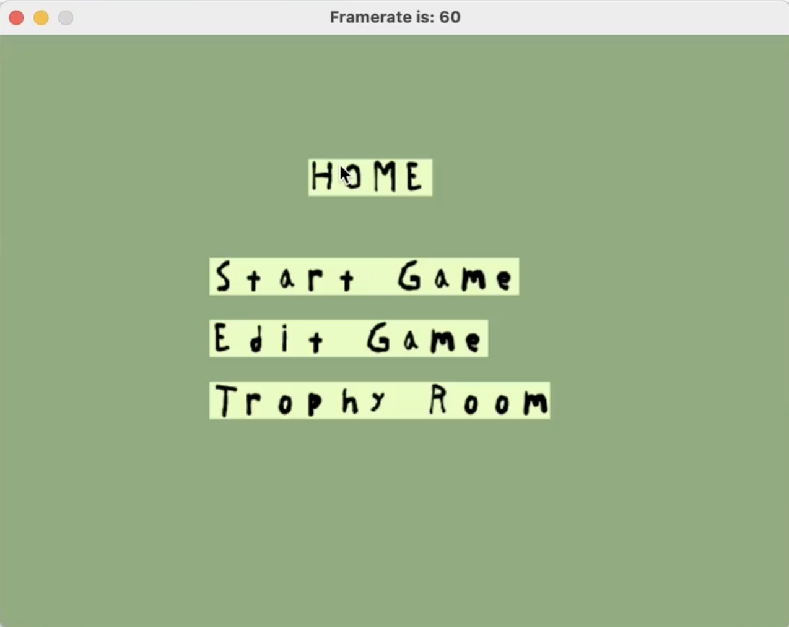
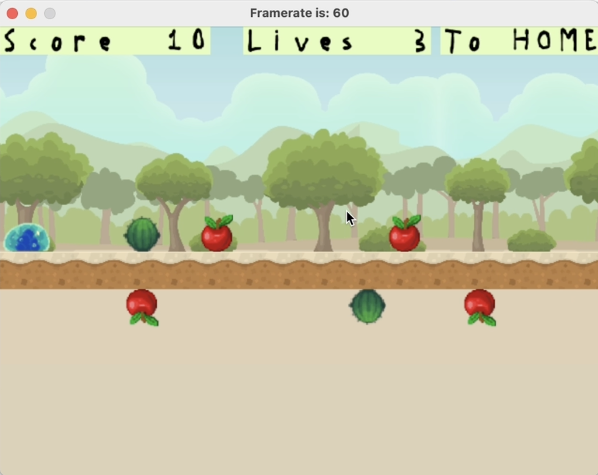
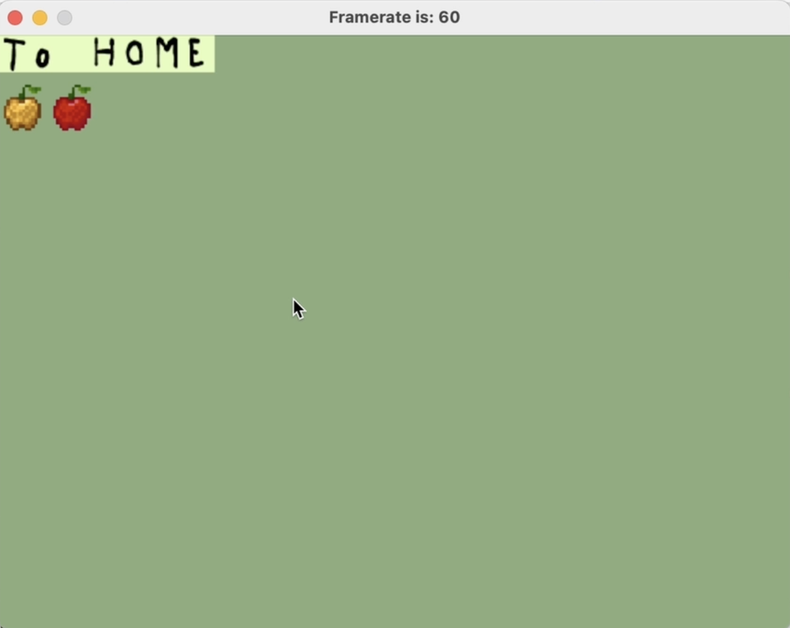
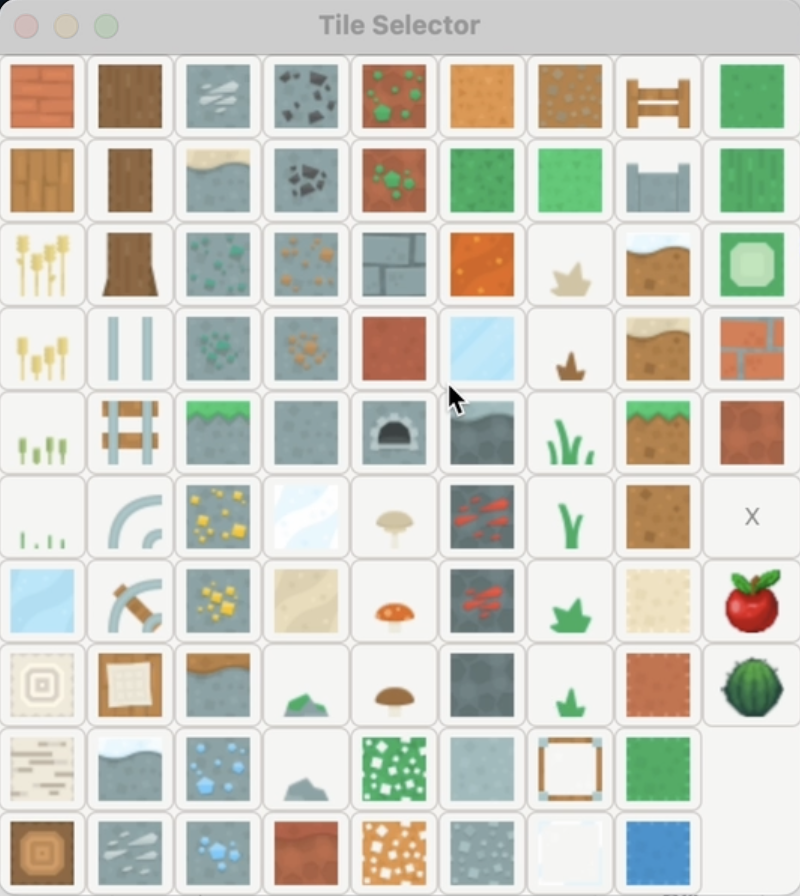
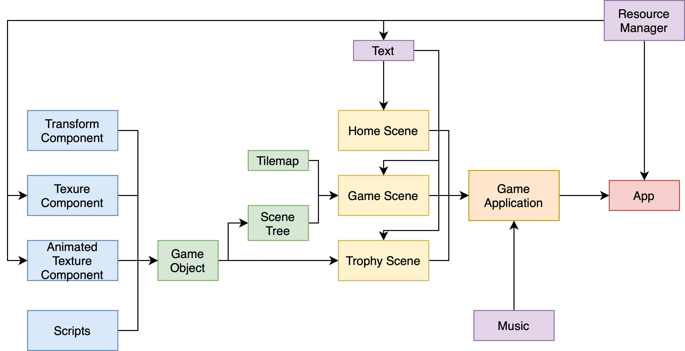

# My Game Engine

<iframe id="ytplayer" type="text/html" width="640" height="360"
  src="https://www.youtube.com/embed/rtEZXfhsqsQ"
  frameborder="0"></iframe>

[Link to Documentation](docs)

[Link to Binary File for Mac Silicon](prog_sdl)

Link to Source Code (To be added)
Compilation Notes: Simply run DUB from the Engine directory.

Post Mortem

If I had more time, I would work on my game play mechanics of awarding additional points when you dodge an obstacle just in time. Currently it's implemented as simply adding 30 points if you flip right before hitting an obstacle, but it's hard to notice that this happened. I would like to implement some type of animation so show that this happened that won't get into the way of the game, but still let the player know and they got extra points for skill. Similarly, I would like to add collison animations and animations for winning and losing the game.

I would also want to create multiple levels for the game and allow the editor to edit all these levels. Levels can differ from each other by the length of the world, the number of obstacles, or the speed of the player.

I also originally wanted to make my trophy room more interactable. I wanted my trophies to be plants that the player can water to make them grow.

It will also be nice to get a license so that my binary won't be treated as malware when downloaded from this website. 